# URL Shortener API

A simple Node.js + Express + SQLite URL shortener service.  
You can create a short code for a given URL and retrieve the original URL using that code.

---
## 🚀 Getting Started

### **Prerequisites**
- [Node.js](https://nodejs.org/) v21 or later
- [Postman](https://www.postman.com/) (for API testing)
- SQLite (already included with the `sqlite3` npm package)

---

### **Installation**
1. Clone the repository:
```bash
git clone <your-repo-url>
cd <your-repo-folder>
```

2. Install dependencies:

```bash
npm install
```

3. Start the server:

```bash
npm run dev
```

By default, the server runs at:

```
http://localhost:3000
```

---

## 📌 API Endpoints

### 1️⃣ POST `/shorten`

**Description:**
Creates a short code for a given URL.
If the URL already exists in the database, it will return the existing short code.

**Request:**

* **Method:** `POST`
* **URL:** `http://localhost:3000/shorten`
* **Headers:**

  ```
  Content-Type: application/json
  ```
* **Body (raw JSON):**

```json
{
  "url": "https://example.com"
}
```

**Response Example (URL already exists):**

```json
{
  "short_code": "abc123"
}
```

**Response Example (New short code):**

```json
{
  "short_code": "xyz789"
}
```

---

### 2️⃣ GET `/redirect`

**Description:**
Retrieves the original URL for a given short code.

**Request:**

* **Method:** `GET`
* **URL:**

```
http://localhost:3000/redirect?code=abc123
```

* Replace `abc123` with the short code you got from `/shorten`.

**Response Example (Found):**

```json
{
  "url": "https://example.com"
}
```

**Error Example (Not Found):**

```json
{
  "error": "Short code not found"
}
```

**Error Example (Missing Code):**

```json
{
  "error": "Short code is required"
}
```

---

## 🧪 Testing with Postman

### **Step 1: Shorten a URL**

1. Open Postman and create a new request.
2. Set the method to **POST**.
3. Enter the request URL:

```
http://localhost:3000/shorten
```

4. Go to the **Body** tab → Select **raw** → Choose `JSON` from the dropdown.
5. Enter the JSON payload:

```json
{
  "url": "https://example.com"
}
```

6. Click **Send**.
7. Copy the `short_code` or `shortCode` from the response.

---

### **Step 2: Redirect using Short Code**

1. Create a new request in Postman.
2. Set the method to **GET**.
3. Enter the request URL:

```
http://localhost:3000/redirect?code=<SHORT_CODE>
```

Replace `<SHORT_CODE>` with the one from Step 1.
4\. Click **Send** to retrieve the original URL.

---
## Integrated Tests

* Run the 'app.test.js' file with 
```bash
npm run test
```
* this will run test file. 

Here’s the project screenshot:

10 vus - redirect
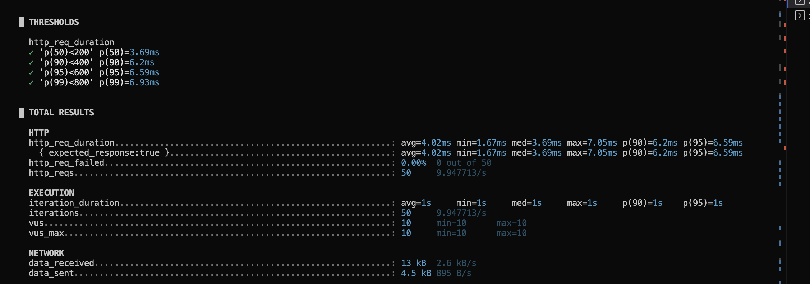

50 vus - redirect
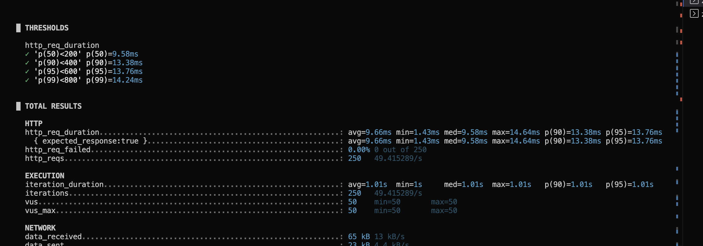

100 vus - redirect
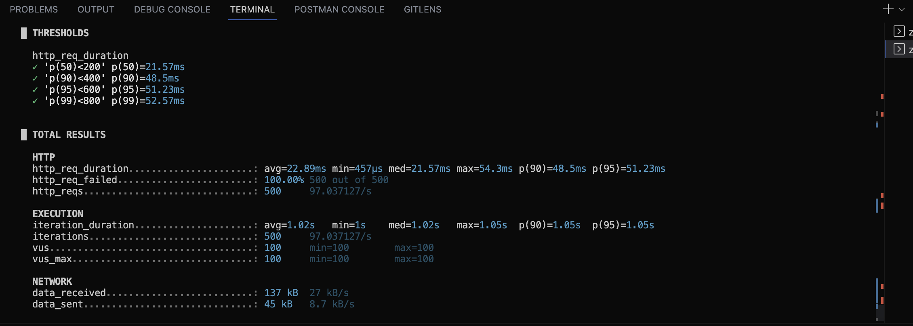

200 vus - redirect


500 vus - redirect
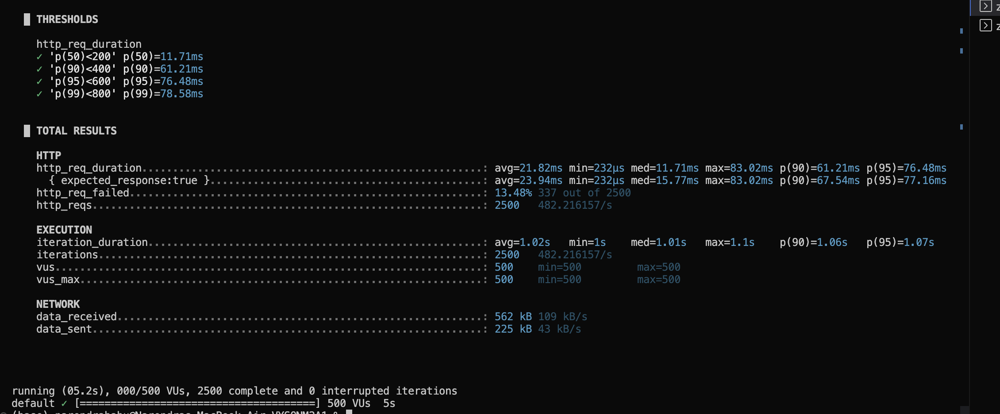

1k vus - redirect


2k vus - redirect
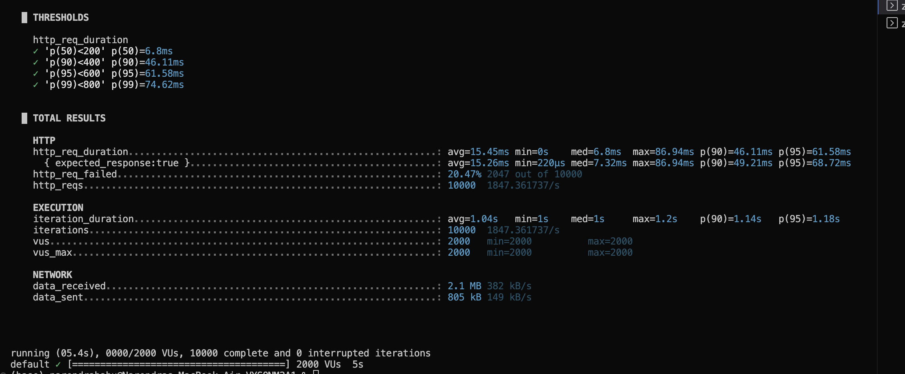

4k vus - redirect


8k vus - redirect
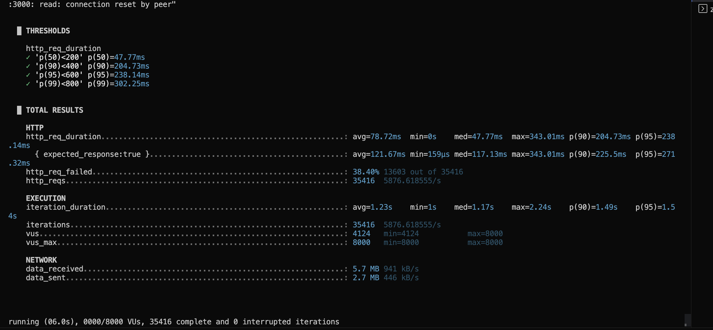

16k vus - redirect
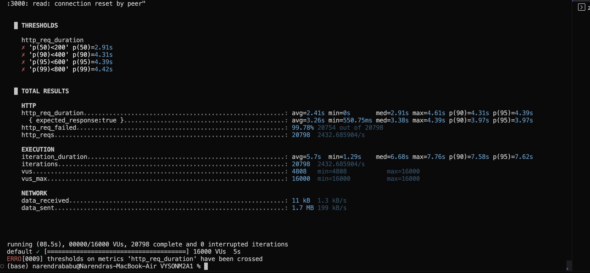

10 vus - shorten
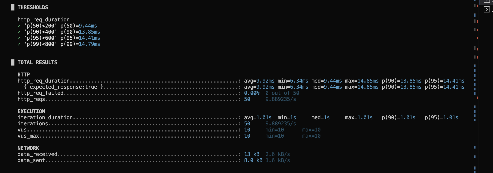

50 vus - shorten
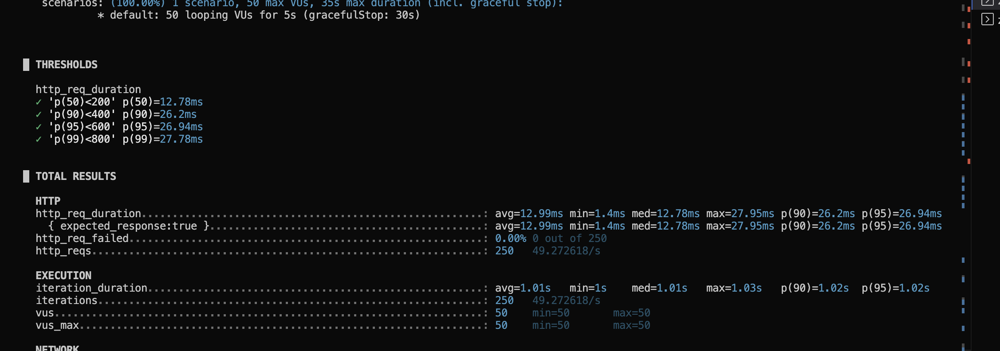

100 vus - shorten


200 vus - shorten


500 vus - shorten
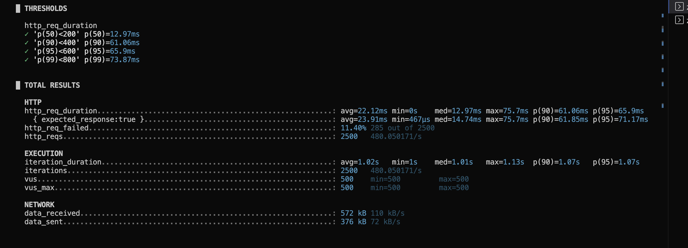

1k vus - shorten
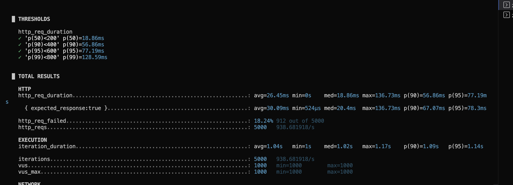

2k vus - shorten
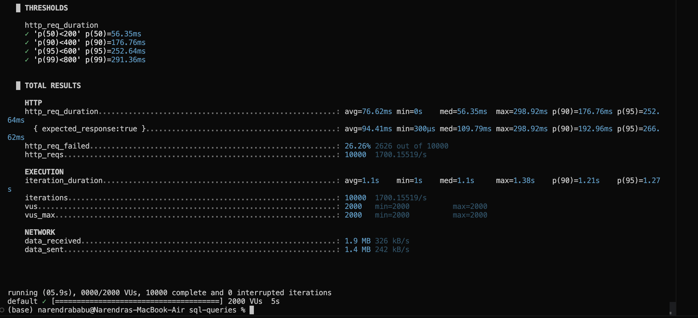

4k vus - shorten
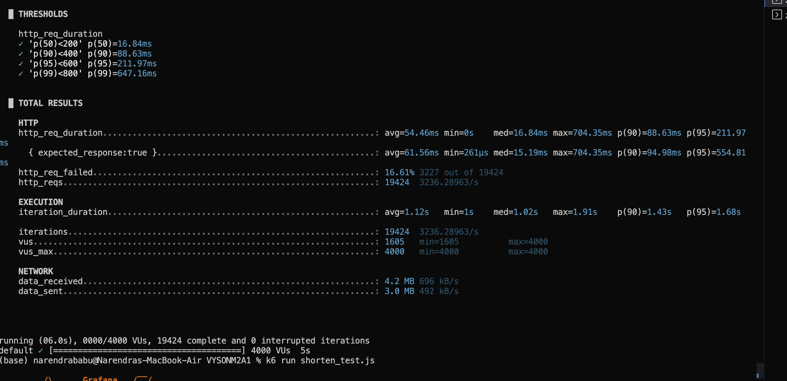

8k vus - shorten
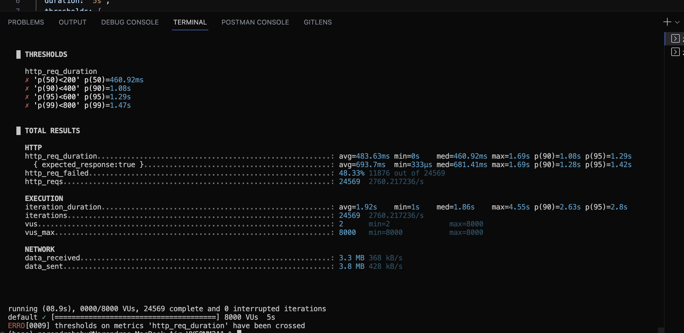

## 📂 Notes

* Sending the same URL multiple times returns the same short code.
* This project uses a local SQLite database (`sqlite3` npm package).
* Short codes are unique — if a collision occurs, a new code is generated automatically.

---

## 🛠 Tech Stack

* Node.js
* Express.js
* SQLite3

---

## 📄 License

This project is open-source and available under the [MIT License](LICENSE).
